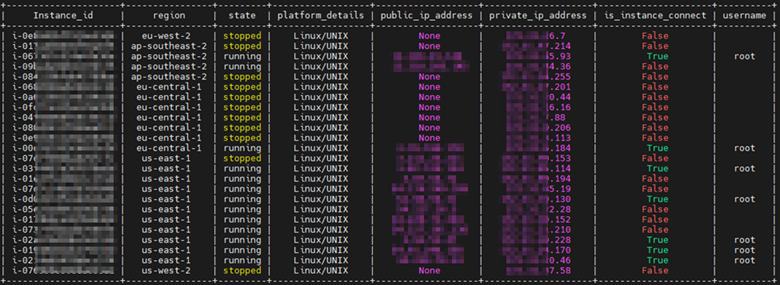
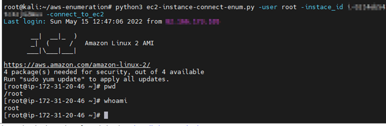

# Instance_connect_enum

Script to enumerate ec2's in aws orgnaziation and check which instances are possible to connect to, using instnace connect.  <br />
The script uses the following Amazon libaries: <br />
[Boto3](https://boto3.amazonaws.com/v1/documentation/api/latest/index.html) <br />
[aws-ec2-instance-connect-cli](https://github.com/aws/aws-ec2-instance-connect-cli)

For full functionality, the script will require a user/role with the following AWS permissions:
  - ec2:DescribeInstances
  - ec2-instance-connect:SendSSHPublicKey
  - ec2:DescribeRegions
  
# Usage
- The script supports python3 
- Installing:  ``` pip install -r requierments.txt  ```

 *EC2 enumeration with user credentials*:
 ``` python3 ec2-instance-connect-enum.py -aws_access_key <aws_access_key> -aws_secret <aws secret access key>  -enum_ec2 ```
 
 *EC2 enumeration with role credentials*:
  ``` python3 ec2-instance-connect-enum.py -aws_access_key <aws_access_key> -aws_secret <aws secret access key> -aws_session_token <aws session token> -enum_ec2 ```   <br /> <br /> 


 *Connect to EC2 using instance connect with role credentials:*
 ``` python3 ec2-instance-connect-enum.py -aws_access_key <aws_access_key> -aws_secret <aws secret access key>  -user <ec2 instance user> -region <ec2 instance region> -instance_id <instance id> -aws_session_token <aws session token> -connect_to_ec2 ```

 *Connect to EC2 using instance connect with user credentials:*
 ``` python3 ec2-instance-connect-enum.py -aws_access_key <aws_access_key> -aws_secret <aws secret access key>  -user <ec2 instance user> -region <ec2 instance region> -instance_id <instance id> -connect_to_ec2 ``` <br /> <br /> 
  
